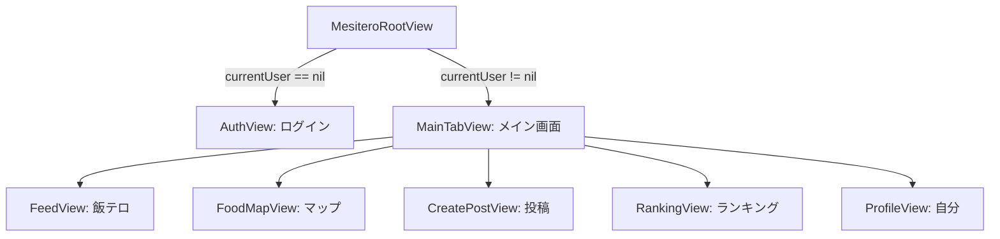

# MeshiTero（飯テロ）アプリ仕様書

深夜の飯テロ画像をゆるく共有し、背徳感を楽しむ iOS アプリ「**MeshiTero**」の機能および設計仕様書です。

---

## 1. アプリ概要

* **アプリ名**: MeshiTero (飯テロナイト)
* **プラットフォーム**: iOS (SwiftUI)
* **コンセプト**: 「深夜の飯を、ゆるく共有する」
  * ユーザーが夜中に食べたもの（ラーメン、アレンジめし、深夜めしなど）を写真や危険度指数とともに投稿。
  * 深夜時間帯（22:00〜5:00）に投稿された内容をベースとした「深夜ランキング」や、深夜限定で表示される「夜間限定投稿」などの背徳的エンターテインメント要素を提供。

---

## 2. アーキテクチャとデータモデル

アプリは SwiftUI を用いた状態管理（ObservableObject）で構築されており、アプリ内の状態はグローバルクラス `AppState` で一元管理されています。

### 2.1. データモデル ([Models.swift](file:///Users/chocho/Desktop/MeshiTero/MeshiTero/Models.swift))

#### `UserAccount`
ユーザーのアカウント情報を定義します。
* `id` (`UUID`): アカウントの一意識別子。
* `userName` (`String`): 表示名。
* `email` (`String`): メールアドレス（現在は認証の簡略化のため空欄が基本）。
* `badgeTitle` (`String`): ユーザーの称号（デフォルト: `"夜食ビギナー"`）。

#### `FoodCategory` (Enum)
飯テロ写真のカテゴリ。
* `ramen` ("ラーメン")
* `cupNoodle` ("アレンジめし")
* `riceBowl` ("丼もの")
* `meat` ("肉")
* `fried` ("揚げ物")
* `midnightMeal` ("深夜めし")

#### `FoodPost`
タイムラインに投稿される飯テロ情報。
* `id` (`UUID`): 投稿の一意識別子。
* `userName` (`String`): 投稿者のユーザー名。
* `foodName` (`String`): 料理名。
* `comment` (`String`): 投稿コメント。
* `emotionTag` (`String`): 選択されたハンコ（スタンプ）テキスト。
* `category` (`FoodCategory`): 料理のカテゴリ。
* `dangerLevel` (`Int`): 背徳感（1〜5の数値）。
* `soundLevel` (`Int`): 音のうるささ（1〜5の数値、将来的な拡張用）。
* `midnightLevel` (`Int`): 深夜危険度（1〜5の数値）。
* `image` (`UIImage?`): 添付画像。
* `videoURL` (`URL?`): 添付動画。
* `createdAt` (`Date`): 投稿日時（デフォルト: 現在時刻）。
* `wantCount` (`Int`): 「食べたい」リアクション数。
* `lostCount` (`Int`): 「負けた」リアクション数。
* `itadakimasuCount` (`Int`): 「いただきます」リアクション数。
* `isNightOnly` (`Bool`): 深夜時間帯（22:00〜5:00）のみ表示するフラグ。
* `isRestaurant` (`Bool`): 飲食店かどうかのフラグ。
* `restaurantName` (`String`): 店舗名。
* `address` (`String`): 店舗住所。
* `latitude` (`Double?`): 店舗の位置情報（緯度）。
* `longitude` (`Double?`): 店舗の位置情報（経度）。
* `stampText` (`String`): 飯テロ認定スタンプ（デフォルト: `"鬼ヤバ"`）。

### 2.2. グローバル状態管理 ([AppState.swift](file:///Users/chocho/Desktop/MeshiTero/MeshiTero/AppState.swift))

`AppState` クラスは `ObservableObject` として実装され、アプリ全体でデータを共有します。

* **主なプロパティ**:
  * `currentUser` (`UserAccount?`): 現在ログインしているユーザー情報。`nil` の場合はログイン（ユーザー名入力）画面になります。
  * `nowEatingCount` (`Int`): 現在食事をしている仮想の人数（デフォルト: `327`人、いただきますリアクションごとに+1）。
  * `onlineCount` (`Int`): 現在のアクティブオンライン人数。
  * `posts` (`[FoodPost]`): 全投稿リスト。
  * `visiblePosts` (`[FoodPost]`): フィルタリングされた表示対象の投稿リスト（`isNightOnly` が `true` の投稿について、22:00〜5:00以外の時間帯では非表示にする制御を行う）。
* **主なメソッド**:
  * `addPost(_:)`: 新しい投稿をリストの先頭に追加する。
  * `updatePost(_:)`: 指定された投稿の内容を更新する。
  * `deletePost(_:)`: 指定された投稿を削除する。
  * `tapWant(_:)`, `tapLost(_:)`, `tapItadakimasu(_:)`: 各種リアクション数をインクリメントする（重複タップ防止のための Set 制御あり）。

---

## 3. 画面仕様とビュー構成

アプリは `MesiteroRootView` を親として、ユーザーのログイン状態に合わせて画面を出し分けます。

### 3.1. 認証画面 ([AuthView.swift](file:///Users/chocho/Desktop/MeshiTero/MeshiTero/AuthView.swift))
* **目的**: ユーザーがアプリを利用開始するための簡易サインイン画面。
* **仕様**:
  * ニックネームの入力フィールドを提供。
  * メールアドレスやパスワードを必要とせず、「はじめる」ボタンをタップするだけで即座に `UserAccount` が作成されログイン状態になります。
  * ニックネームが未入力の場合、「はじめる」ボタンは無効化されます。

### 3.2. 飯テロタイムライン ([FeedView.swift](file:///Users/chocho/Desktop/MeshiTero/MeshiTero/FeedView.swift))
* **目的**: 投稿された飯テロのコンテンツをスクロールして閲覧・反応するタイムライン。
* **仕様**:
  * **夜の空気パネル ([NightAirPanelView.swift](file:///Users/chocho/Desktop/MeshiTero/MeshiTero/NightAirPanelView.swift))**: タイムライン上部に表示され、現在のオンライン人数や「食事中」の人数、トレンドカテゴリ（急増中）などを表示して夜間のライブ感を演出。
  * **カテゴリフィルタ**: 「すべて」および定義されたカテゴリ（ラーメン、アレンジめし等）で投稿を切り替え。
  * **夜間制限フィルタ**: `visiblePosts` により、日中は `isNightOnly` の投稿が表示されないよう動的に制御。
  * **投稿カード ([PostCardView.swift](file:///Users/chocho/Desktop/MeshiTero/MeshiTero/PostCardView.swift))**:
    * 写真または動画（`VideoPlayer`）を表示。
    * 料理名、コメント、店舗情報、スタンプ（「飯テロ認定 [スタンプテキスト]」の斜めハンコ風デザイン）を表示。
    * **飯テロ危険度ゲージ**: 「背徳感」と「深夜危険度」を5段階のインジケーター（ピンクの丸）で視覚的に表現。
    * **リアクション**: 「食べたい」「負けた」「コメント」ボタン。
    * 投稿主用メニュー: 右上の三点リーダー（`ellipsis`）から投稿の「編集」または「削除（確認アラート付き）」が可能。

### 3.3. マップ画面 ([MapView.swift](file:///Users/chocho/Desktop/MeshiTero/MeshiTero/MapView.swift))
* **目的**: 位置情報が紐づいた飯テロ店舗を地図上にマッピングする画面。
* **仕様**:
  * `MapKit` を利用し、デフォルト位置は東京駅周辺。
  * 投稿に `latitude`/`longitude` が登録されている店舗をマップ上のアノテーションとして表示。
  * ピンをタップすると、店舗名または料理名が吹き出しで表示される。

### 3.4. 投稿作成画面 ([CreatePostView.swift](file:///Users/chocho/Desktop/MeshiTero/MeshiTero/CreatePostView.swift))
* **目的**: 新たな飯テロ情報を写真・指標とともに登録する画面。
* **仕様**:
  * **写真追加**:
    * カメラを起動してその場で撮影する、またはフォトライブラリから選択する機能を提供（UIKit の `UIImagePickerController` をラップした [CameraPicker.swift](file:///Users/chocho/Desktop/MeshiTero/MeshiTero/CameraPicker.swift) をシートで表示）。
  * **お店の紐付け**:
    * 「お店の投稿」トグルをONにすると、[PlacePickerView.swift](file:///Users/chocho/Desktop/MeshiTero/MeshiTero/PlacePickerView.swift) から近くのスポットを検索・選択可能。
    * CoreLocation による現在地周辺検索（`MKLocalSearch`）を使用し、選択された店舗名、住所、座標情報を自動入力。
  * **詳細情報**:
    * 料理名、コメント、カテゴリ、ハンコ（「鬼ヤバ」「高カロリー」「背徳」「深夜注意」「危険飯」から選択）を入力。
  * **飯テロ指数設定**:
    * 背徳感、深夜危険度を 1〜5 のスライダーで設定。
  * **公開設定**:
    * 「22時〜5時だけ見られる投稿にする」トグルをONにすると、`isNightOnly` フラグが有効化。
  * **投稿ボタン**:
    * 料理名、コメント、写真が揃っている場合のみ活性化。タップでタイムラインに追加し、フォームをリセットする。

### 3.5. 投稿編集画面 ([EditPostView.swift](file:///Users/chocho/Desktop/MeshiTero/MeshiTero/EditPostView.swift))
* **目的**: 投稿したコンテンツ内容を事後的に変更するシート画面。
* **仕様**:
  * 料理名、コメント、ハンコ、飯テロ指数（背徳感・深夜危険度）、公開設定（夜間限定）、店舗情報（店名・住所）の書き換えと保存が可能。

### 3.6. 深夜ランキング画面 ([RankingView.swift](file:///Users/chocho/Desktop/MeshiTero/MeshiTero/RankingView.swift))
* **目的**: 深夜帯（22:00〜5:00）に投稿された「真の飯テロ」をスコア順に表示する画面。
* **仕様**:
  * **集計対象**: 投稿日時 (`createdAt`) が 22:00〜5:00 の間のもの。
  * **スコアリングロジック**:
    $$\text{Score} = \text{wantCount} + (\text{lostCount} \times 2) + \text{itadakimasuCount}$$
    * 「見せられて敗北した（＝負けた）」リアクションを最も高く評価する、飯テロアプリならではの配点。
  * **デザイン**:
    * 順位ごとにメダル（🥇, 🥈, 🥉）を表示。
    * 上位3位までは背景が暖色系の華やかなグラデーションになり、4位以降は暗めのグラデーションで差別化。
  * **投稿がない場合**: 空の状態を示す「まだ深夜投稿がありません」のメッセージと月のアートを表示。

### 3.7. プロフィール画面 ([ProfileView.swift](file:///Users/chocho/Desktop/MeshiTero/MeshiTero/ProfileView.swift))
* **目的**: ユーザー情報の確認とアプリからのログアウトを行う画面。
* **仕様**:
  * ユーザーのアイコン、ユーザー名、そのユーザーがこれまでに投稿した飯テロ件数（`myPosts.count`）を表示。
  * 「ログアウト」ボタンをタップすると、`currentUser` がクリアされて最初のニックネーム入力画面（`AuthView`）に遷移。

---

## 4. 補足開発リソース

* **サンプル動画**: `sample_ramen.mov` （初期値の深夜味噌ラーメン用の再生用リソース）
* **アセット**: `Assets.xcassets` (アプリアイコンやシステムカラーなど)
